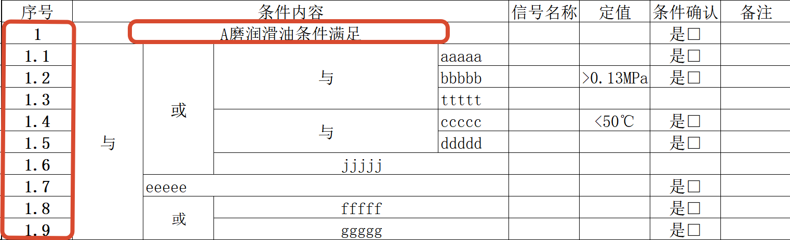
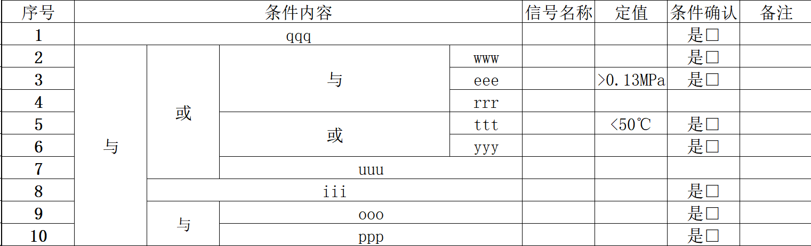

# ExpCard Converter

试验卡数据提取工具，将 Excel 试验卡中的逻辑条件快速提取并转换为 Markdown 格式，支持导出为 Word 文档。

## 核心功能

- **智能逻辑提取** — 自动识别"与"、"且"、"或"、"或取反"等逻辑运算符
- **双模式转换** — 支持子序号模式（x.y 格式）和纯数字模式（列嵌套）
- **特殊分隔符处理** — 自动检测并转换"或延时"、"与延时"等特殊分隔符
- **Word 导出** — 通过 pandoc 将 Markdown 转换为 `.docx` 格式
- **多主题支持** — 浅色、深色、毛玻璃三种 UI 主题
- **大纲导航** — 可折叠的大纲树，快速定位内容

## 快速开始

### 方式一：使用启动脚本（推荐）

右键`start.ps1` 使用`PowerShell`，选择 `[1] 启动服务`，其余交给脚本处理。

**启动脚本会自动完成以下操作：**
- 检测配置文件、Word 转换工具（pandoc）是否存在
- 检测端口 3210 是否被占用，若被占用则自动关闭旧进程释放端口
- 在后台启动服务（不占用终端窗口）
- 等待服务就绪后自动打开浏览器

你只需拖入 Excel 文件、选择工作表、点击转换，无需手动操作端口和浏览器。

### 方式二：手动启动

直接双击`expcard-converter.exe`，服务后台启动（服务会永驻后台，需任务管理器来结束）

服务启动后手动访问 `http://localhost:3210`

## 使用帮助

### 使用步骤

1. 右键 `start.ps1` 启动程序
2. 选择 `[1]` 启动服务
3. 浏览器会自动打开
4. 拖入或点击上传 Excel 文件
5. 选择要转换的工作表
6. 点击「转换」按钮
7. 预览结果并导出

### 注意事项

- **文件格式**：仅支持 `.xlsx` 格式
- **旧格式处理**：若您的文件是 `.xls` 格式，请先用 Excel 另存为 `.xlsx`
- **停止服务**：关闭启动窗口将停止服务，脚本会自动清理端口占用
- **端口配置**：默认端口 3210，重复启动无需担心端口冲突，脚本会自动处理

### 启动菜单

```
+--------------------------------------------------------+
|    [ 1 ]  启动服务                                  |
|    [ 2 ]  编辑配置                                  |
|    [ 3 ]  使用帮助                                  |
|    [ 0 ]  退出程序                                  |
+--------------------------------------------------------+
```

### 启动服务流程

脚本在后台依次完成以下检测，无需手动干预：

1. 检测 `config.js` 配置文件是否存在
2. 检测 `pandoc.exe` Word 转换工具（缺少则导出 Word 功能不可用）
3. 检测程序文件（优先打包版本 `.exe`，其次开发版本 `server.js`）
4. 检测端口 3210 是否被占用 → **若被占用，自动关闭占用端口的旧进程**
5. 后台启动服务（`-WindowStyle Hidden`，不弹出新的命令行窗口）
6. 等待服务就绪后**自动打开浏览器**

## 配置文件

配置文件 `config.js` 位于程序目录，可在启动前修改。

### 配置项说明

```javascript
const EXPCARD_CONFIG = {
  // 逻辑运算符映射
  LOGIC_OPERATORS: {
    "与": "且",      // Excel中的"与" → 输出"且"
    "且": "且",      // Excel中的"且" → 输出"且"
    "或": "或",      // Excel中的"或" → 输出"或"
    "或取反": "或取反",  // Excel中的"或取反" → 输出"或取反"
  },

  // 特殊分隔符映射
  SPECIAL_SEPARATORS: {
    "或延时": "或",  // Excel中的"或延时xxx" → 输出"或"
    "与延时": "且",  // Excel中的"与延时xxx" → 输出"且"
  },

  // 跳过的表头（不处理的行）
  SKIP_HEADERS: ["序号", "条件确认"],

  // 段落标题（这些标题下的内容不进行逻辑转换）
  SECTION_HEADERS: ["试验条件", "试验恢复", "结论", "存在问题"],
};
```

### 修改后生效

保存 `config.js` 后，需要重启服务才能生效。

## Excel 文件规范

### 文件格式

- 格式：`.xlsx`（不支持 `.xls`）
- 编码：UTF-8
- 首行：表头行（会被自动跳过）

### 两种处理模式

#### 模式一：子序号模式（x.y 格式）

A 列使用 `x.y` 格式的编号（如 `1.1`、`1.2`、`2.1`）。

纯数字包含x.y的子序号，其余逻辑通过列嵌套表达层级关系



**转换效果：**


#### 模式二：纯数字模式

A 列使用纯数字编号（如 `1`、`2`、`3`），通过列嵌套表达层级关系。



**转换效果**：


### 逻辑运算符

| Excel 值 | 输出值 | 说明 |
|---------|-------|------|
| 与 | 且 | 逻辑与 |
| 且 | 且 | 逻辑与（同义词） |
| 或 | 或 | 逻辑或 |
| 或取反 | （或取反） | 逻辑异或 |

### 特殊分隔符

| 特殊值 | 转换为 | 匹配方式 |
|-------|-------|---------|
| 或延时 | 或 | 前缀匹配（如 `或延时720s` → `或`） |
| 与延时 | 且 | 前缀匹配（如 `与延时300s` → `且`） |

## 文件结构

```
dcs-expcard-tool-nodejs/
├── index.html              # 主页面（界面、交互逻辑、3种主题）
├── convert.js              # 转换核心逻辑（ExpCardConverter 类）
├── config.js               # 配置字典（逻辑运算符、特殊分隔符等）
├── server.js               # Express 服务端（MD→Word 转换）
├── pandoc.exe              # Pandoc 可执行文件（MD→Word）
├── package.json            # 项目依赖
├── start.ps1               # PowerShell 启动脚本
├── build.js                # SEA 打包脚本
├── sea-config.json         # SEA 配置文件
└── README.md               # 本文档
```

## 打包为可执行文件

使用 Node.js SEA（Single Executable Application）打包为独立 exe。

### 环境要求

- Node.js >= 20
- Windows 操作系统

### 打包步骤

```bash
# 1. 安装依赖
npm install

# 2. 执行打包
npm run build
```

### 发布包结构

```
dist/
├── expcard-converter.exe    # 主程序
├── config.js                # 配置文件（外置可修改）
├── pandoc.exe               # Word 转换工具
├── start.ps1                # PowerShell 启动脚本
└── start.bat                # 启动脚本
```

## API 接口

### POST /api/convert-to-word

将 Markdown 内容转换为 Word 文档。

**请求体：**
```json
{
  "markdown": "## 一、试验项目\n...",
  "filename": "试验卡"
}
```

**响应：** `.docx` 文件流

**错误处理：**
- 400：Markdown 内容为空
- 500：Pandoc 转换失败

## 技术栈

- **前端**：纯 HTML/CSS/JS，xlsx.js（Excel 解析）、marked.js（Markdown 渲染）
- **后端**：Express.js（Node.js）
- **转换**：Pandoc（Markdown → Word）
- **打包**：SEA（Single Executable Application）
- **启动**：PowerShell 脚本

## 浏览器兼容性

支持所有现代浏览器：
- Chrome 80+
- Firefox 75+
- Safari 13+
- Edge 80+
